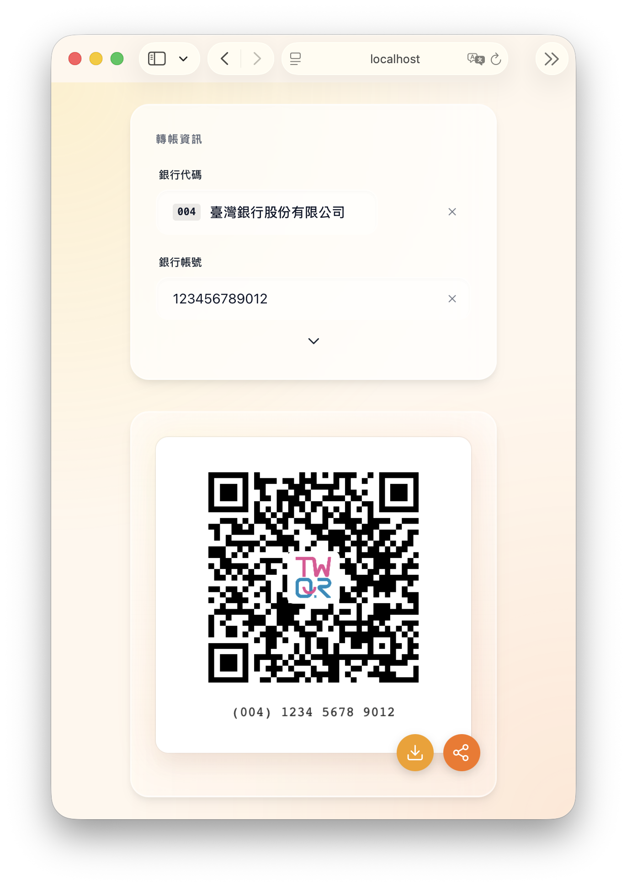

# 給我錢

*TL;DR*
This tool that generates TWQR-compliant QR Codes, enabling interoperability between different banks.

[TWQR] 是個很方便格的格式，可以讓你用行動銀行掃描 QR Code 就能轉帳給對方、而且不會因為銀行不同就被排擠。

這個工具設計來產生符合 TWQR 格式的 QR Code，讓人們在要錢的時候可以更方便。

[TWQR]: https://www.twqr.com.tw/

<!-- 🎵🎵🎵 我只是想 cue 這首歌 🎵🎵🎵 -->

> 🎶
> 給我錢
> 好讓我能更快享受這一切
> 給我錢
> 因為錢就是我的快樂泉源
>
> -- [小紫aka給我錢 - 芒果醬](https://www.youtube.com/watch?v=gCa2L_mC3w8)

## 使用方法

本工具會自動部署於 GitHub Pages，請前往以下網址使用：

🔗 https://twqr.tzing.dev/
